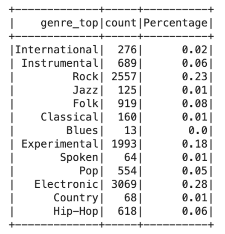
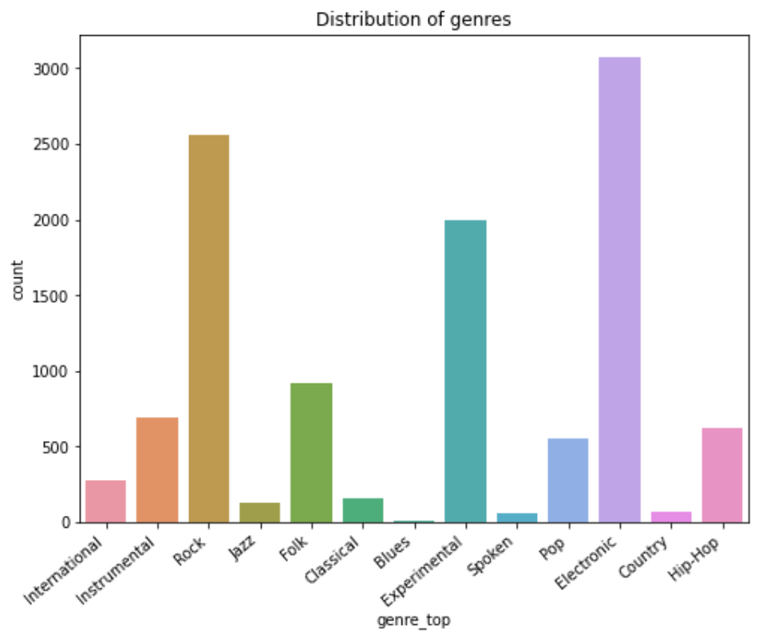
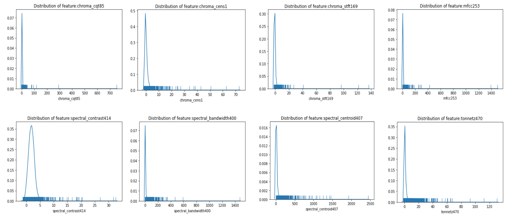

# 502_final_repo

# Files

`Code.ipynb` is the code file

`instance-metadata.json` 

And others are images used in `README.md` 

# Write-Ups

## 1. Introduction
** 1.1 Objective **

The data science question raised is whether we can predict the genre of songs given the FMA datasets. We believe it is worth investigating the topic of the classification of music genres since it would be helpful for song recommendation in music applications. Since there are multiple classes of genre labels in this dataset, it becomes a multiclass classification problem. We expected to tune the classifiers to have an accuracy of more than 50%, though it would be difficult to achieve. However, we would also focus on evaluating the performance of unsupervised learning on grouping music genres.

** 1.2 Datasets **

The FMA aims to overcome this hurdle by providing 917 GiB in total and 343 days of Creative Commons-licensed audio from 106,574 tracks from 16,341 artists and 14,854 albums, arranged in a hierarchical taxonomy of 161 genres. It provides full-length and high-quality audio, pre-computed features, together with track- and user-level metadata, tags, and free-form text such as biographies. There are different sizes of dataset provided, and our team extracted a medium size dataset, which is 22GiB and has 25,000 tracks of songs consisting 16 unbalanced genres, to ingest into S3 for analysis. There are 518 columns of features extracted by LibROSA, which is a python package for music and audio analysis. The label column is the genre of songs, and there is one more identity column called “track ID”. It is hard to use all 518 features for modeling, so we selected 10 features out of them for further analysis.

** 1.3 Exploratory Data Analysis **

The first step is to check the balance of the target variable genre type. Top 13 genres were selected, and the percentage of each genre type is shown in Table 1.3.1, we can tell that the data is not very balanced. The "Rock" label, "Electronic” label and “Experimental'' label take up 70% among all labels and all other label types only take up 30%. 

**Table 1.3.1 Balance of target variables**   

**Figure 1.3.1 Balance of target variables**

Next step, we need to check the collinearity of features. From the Figure 1.3.2 below, we can conclude that features 'spectral_rolloff463' have a relatively strong and positive relationship with spectral_bandwidth400' (r = 0.66) and 'spectral_centroid407'(r = 0.56), while others are very weakly or not correlated. So we decide to exclude this feature when conducting machine learning models.

**Figure 1.3.2 Correlation plot of features**

The last part of exploratory data analysis is to check the distribution of features. From the below Figure 1.3.3, we can conclude that the distribution of all features are highly skewed to the right, and there are outliers for each feature, but since there are infinite possible ways to make a song, they are not exactly "outliers" in real life, so we decide to keep those numbers this time.

**Figure 1.3.3 Distribution of features**

## 2. Methodology

## 3. Results, Conclusions and Next Steps

## 4. Reference and Division of labor
