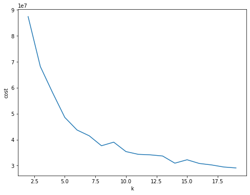

# Analysis on FMA Dataset

# Group Name
Return to Sleep

# Group Members
* Andrey Yuan (ay432)
* Julia Zhu (yz719)
* Yu Xiao (yx197)

# Executive Summary
This project is mainly about unsupervised categorization and music genre recognition on the FMA dataset. To prepare for the modelling, data cleaning and some exploratory data analysis was conducted. After tuning features, unsupervised model K-means clustering and supervised models Logistic regression and Decision tree were applied. The conclusion is that K-means clustering model performs well for unsupervised categorization and Decision Tree has the best performance among all three supervised learning models. 

# Files

* `Code.ipynb` : all codes included

* `instance-metadata.json` 

* Images of figures and tables used in the write up 

#  1. Introduction

## 1.1 Objective

The data science question raised is whether we can predict the genre of songs given the FMA datasets. We believe it is worth investigating the topic of the classification of music genres since it would be helpful for song recommendation in music applications. Since there are multiple classes of genre labels in this dataset, it becomes a multiclass classification problem. We expected to tune the classifiers to have an accuracy of more than 50%, though it would be difficult to achieve. However, we would also focus on evaluating the performance of unsupervised learning on grouping music genres.

## 1.2 Datasets

The FMA aims to overcome this hurdle by providing 917 GiB in total and 343 days of Creative Commons-licensed audio from 106,574 tracks from 16,341 artists and 14,854 albums, arranged in a hierarchical taxonomy of 161 genres. It provides full-length and high-quality audio, pre-computed features, together with track- and user-level metadata, tags, and free-form text such as biographies. There are different sizes of dataset provided, and our team extracted a medium size dataset, which is 22GiB and has 25,000 tracks of songs consisting 16 unbalanced genres, to ingest into S3 for analysis. There are 518 columns of features extracted by LibROSA, which is a python package for music and audio analysis. The label column is the genre of songs, and there is one more identity column called “track ID”. It is hard to use all 518 features for modeling, so we selected 10 features out of them for further analysis.

## 1.3 Exploratory Data Analysis

The first step is to check the balance of the target variable genre type. Top 13 genres were selected, and the percentage of each genre type is shown in Table 1.3.1, we can tell that the data is not very balanced. The "Rock" label, "Electronic” label and “Experimental'' label take up 70% among all labels and all other label types only take up 30%. 

**Table 1.3.1 Balance of target variables**   

**Figure 1.3.1 Balance of target variables**

Next step, we need to check the collinearity of features. From the Figure 1.3.2 below, we can conclude that features 'spectral_rolloff463' have a relatively strong and positive relationship with spectral_bandwidth400' (r = 0.66) and 'spectral_centroid407'(r = 0.56), while others are very weakly or not correlated. So we decide to exclude this feature when conducting machine learning models.

**Figure 1.3.2 Correlation plot of features**

The last part of exploratory data analysis is to check the distribution of features. From the below Figure 1.3.3, we can conclude that the distribution of all features are highly skewed to the right, and there are outliers for each feature, but since there are infinite possible ways to make a song, they are not exactly "outliers" in real life, so we decide to keep those numbers this time.

**Figure 1.3.3 Distribution of features**

# 2. Methodology

## 2.1 Unsupervised learning

K-means clustering is used to divide tracks into distinct groups , called ‘clusters’, according to some common characteristics using Apache Spark and the Spark ML K-Means algorithm. To prepare the data for unsupervised learning, the columns "spectral_rolloff463" and "genre_top" are removed from our data and all data are converted to float type. We pretend there are no labels in our data set. A feature vector is created which stores all features as an array of floats.  To optimize k we cluster a fraction of the data for different choices of k and look for an "elbow" in the cost function. Then k is set equal to the optimal choice and the model is trained. The clustering model will be evaluated by computing the Silhouette score:

* If this number is negative, the data cannot be separated at all.
* Values closer to 1 indicate maximum separation.
* Values close to zero mean the data could barely be separated.

## 2.2 Supervised learning

Supervised learning models Logistics Regression  OneVsRest Logistics Regression and Decision Tree have been trained to compare their performance. The features used are chroma_cens1, chroma_cqt8, chroma_stft169, mfcc253, spectral_bandwidth400, spectral_centroid407, spectral_contrast414, tonnetz470, zcr512. We use these characteristics of music to make predictions on the genre of the music. 

While training these models, features are combined together using the vectorAssembler method to create a feature vector.  Then we use StringIndexer to transform the target variable genre_top since genre_top is a string label with many categories. After transforming the features and the label, split the dataset into training set and test set. For the three models,  build a pipeline that consists of transformers and a model estimator respectively, and train the Logistics Regression OneVsRest Logistics Regression and Decision Tree model using the pipeline and training data. Due to the data imbalance, balancing weights is considered when training the models. Finally, evaluate each model using test data.

# 3. Results

## 3.1 Unsupervised learning

The graph below indicates that the cost function floats very little after k=13 , which is also the number of track genres we have selected. 

**Figure 3.1.1 Plot of Cost Function according to the Choices of K**

Setting k=13,  the model is trained on the full data set. Once the training has converged, the centroids of the 13 clusters are printed in the code file and the Silhouette with squared euclidean distance is 0.608, which means that the data can be separated properly into 13 groups. The cost of clustering is 20292685.27.

## 3.2 Supervised learning

The accuracy of the logistic regression model is only 0.27 and the performance is bad, so we train an OneVsRest Logistic Regression model. The idea for OneVsRest Logistic Regression is that for each class, there is a binary classifier: this class or the rest of the class. When doing a multi class classification, choose the class with the highest probability.

The accuracy of the OneVsRest Logistic Regression model is 0.344. The performance is better than logistic regression but still not ideal. 

**Figure 3.1.2.1 Confusion Matrix of OneVsRest Logistic Regression**

The accuracy of the decision tree model is 0.37 and the performance is the best among all three supervised learning models we have trained.

**Figure 3.1.2.2 Confusion Matrix of Decision Tree**

# 4. Conclusions and Future Work
In conclusion, K-means clustering model performs well for unsupervised categorization and  Decision Tree has the best performance among all three supervised learning models. However, the performance is still not ideal, and it is worse than the unsupervised learning models. 

In the future, we might considering selecting different features based on some research on the meaning of these precomputed features. Moreover, more supervised models can be trained to see if the performance is better.

# Reference
* Data source: https://github.com/mdeff/fma
* FMA: A Dataset For Music Analysis: https://arxiv.org/abs/1612.01840
* Usage notebook: https://nbviewer.jupyter.org/github/mdeff/fma/blob/outputs/usage.ipynb

# Division of labor

* Yu Xiao: responsible for ingesting the dataset into AWS, data cleaning and formatting, as well as conducting exploratory data analysis and tuning the features for later modeling.

* Julia Zhu: responsible for training unsupervised learning models K-means clustering and preparing the slides as well as giving the project presentation.

* Audrey Yuan: responsible for feature transformation and training supervised learning models Logistics Regression,  OneVsRest Logistics Regression and Decision Tree
